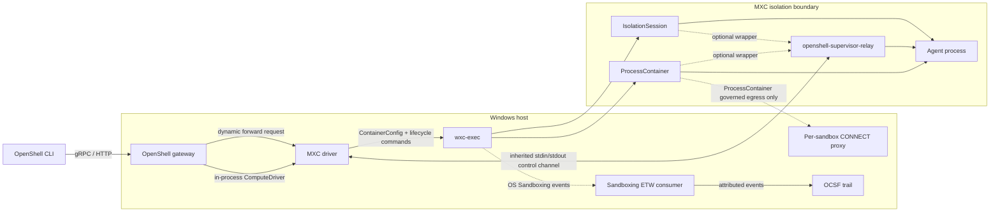

# Windows

OpenShell runs natively on Windows as an MSVC-built CLI and gateway with the
Microsoft MXC compute driver linked into the gateway process. MXC is a
driver-controlled runtime: it applies the canonical policy, launches the agent,
and reports readiness without running the standard `openshell-sandbox`
supervisor inside the workload.

This document describes the stable Windows boundaries. See
[Gateway](gateway.md) for control-plane behavior,
[Compute Runtimes](compute-runtimes.md) for the shared driver contract,
[Security Policy](security-policy.md) for the canonical policy model, and the
[MXC driver README](../crates/openshell-driver-mxc/README.md) for configuration
and operational details.

## Runtime Architecture

The Windows CLI uses the same public gateway API as other platforms. The
gateway owns authentication, persistence, effective-policy composition,
provider attachment, and public sandbox status. The in-process
`MxcComputeBackend` owns MXC configuration, `wxc-exec` lifecycle, host-side
network enforcement, relay state, and runtime watch events.

The following diagram shows the Windows-specific control and data paths. The
MXC isolation boundary contains the agent and optional supervisor relay; the
gateway-side proxy and ETW consumer remain on the host.

`crates/openshell-driver-mxc/src/grpc.rs` adapts the shared `ComputeDriver`
service to the in-process backend. This is a contract boundary, not a network
hop. MXC requests no additional gateway callback listener and does not
authenticate a sandbox principal because there is no standard supervisor
session.

## Backend Semantics

The selected backend changes both lifecycle and enforceable policy. Backend
selection belongs to gateway startup configuration, not to an individual
sandbox request.

| Property | `process_container` | `isolation_session` |
|---|---|---|
| Runtime model | One-shot AppContainer process; default backend | Persistent MXC session used to run one configured process |
| Driver lifecycle | Launch and monitor `wxc-exec` | `provision` -> `start` -> `exec`; stop/delete issue `stop` and `deprovision` |
| Filesystem | Read-only/read-write grants with default-deny behavior | Explicit grant-only compatibility mode; not equivalent to ProcessContainer default deny |
| Portable UI policy | Supported completely | Every explicit `ui` section is rejected before provisioning |
| Governed network policy | Supported through the host proxy when enabled | Rejected because the backend cannot enforce the loopback-only proxy path; without an explicit network policy, the backend retains MXC's default-allow egress |
| Supervisor relay and dynamic forwarding | Optional | Optional |

Neither backend implements interactive `sandbox connect` or interactive exec
through the standard supervisor protocol. The MXC `StartSandbox` operation is
also unsupported: create performs the initial launch, and a stopped workload is
not restarted in place.

## Create and Policy Flow

The gateway composes the effective `SandboxPolicy` before calling the driver and
includes it in `DriverSandboxSpec.policy`. The MXC driver validates and maps that
typed policy before it publishes a registry entry or invokes `wxc-exec`, so an
unsupported policy cannot leave a partially provisioned sandbox.

The create path is:

1. The gateway resolves the canonical command, environment, working directory,
   effective policy, and attached provider state.
2. The gateway checks driver capabilities. In particular, it rejects an
   explicit UI policy when the configured MXC backend does not advertise full
   UI support.
3. `MxcComputeBackend::validate_sandbox_create` validates MXC-specific workload
   inputs and calls `EmbeddedPolicyMapper`.
4. The mapper produces the MXC filesystem, UI, and network configuration. Any
   loss item classified as an error rejects creation; warnings and informational
   items do not block mapping.
5. The driver starts any required host proxy, stages public proxy CA material,
   launches `wxc-exec`, and publishes lifecycle events through the shared watch
   stream.

The production mapping in
`crates/openshell-driver-mxc/src/policy.rs` and
`crates/openshell-driver-mxc/src/policy_map/` treats policy areas as follows:

| Policy area | Windows enforcement |
|---|---|
| Filesystem | `read_only` and `read_write` become MXC path grants. `include_workdir` adds the resolved working directory as read-write. The mapper normalizes separators but does not translate Linux-rooted locations into Windows paths. ProcessContainer supplies the default-deny boundary; IsolationSession supplies only the requested grants. |
| Network | An explicit network policy requires governed egress on ProcessContainer. The mapper gives MXC loopback-only egress and returns the complete network policy to a per-sandbox host CONNECT proxy. MXC denies direct Internet access; the proxy evaluates destinations, ports, TLS/L7 rules, credential bindings, and binary rules against the configured agent command as its static process identity. Network middleware configuration is rejected because the host proxy does not receive the gateway middleware registry. IsolationSession rejects explicit network policy; without one, it retains MXC's default-allow egress. |
| UI | ProcessContainer maps graphical UI, directional clipboard access, and input injection into MXC's top-level `ui` object. An absent section maps to the restrictive UI posture. Within an explicit section, omitted fields deny. IsolationSession rejects even an empty explicit section. |
| Process | MXC supplies the Windows process-isolation boundary, but the mapper has no portable equivalent for `run_as_user` or `run_as_group`; callers must not treat those fields as enforced Windows identity controls. The canonical command, environment, and working directory are launch inputs rather than process-policy grants. |
| Landlock | MXC has no equivalent for the Linux Landlock compatibility mode, including `hard_requirement`. The mapper reports a non-blocking warning; Windows filesystem assurance comes from the selected MXC backend's native semantics, not Landlock. |

The driver reports `supports_live_policy_updates = false`. The gateway therefore
rejects mutations that would change a running MXC sandbox's effective policy or
provider bindings before persistence. Filesystem, UI, network, and credential
changes require sandbox recreation.

## Governed Egress and Credentials

Governed egress uses a split enforcement model. MXC blocks direct Internet
traffic and permits host loopback; a unique authenticated proxy listener holds
the full OpenShell network policy. The driver injects standard proxy variables
for proxy-aware clients and stages only public CA certificates under an
authorized sandbox path. The ephemeral CA private key remains in host-proxy
memory.

The loopback grant is broader than the proxy listener: a governed sandbox can
reach other host services bound to loopback. Per-sandbox proxy credentials
prevent another sandbox from using the OpenShell proxy, but they do not isolate
unrelated host-loopback services or authenticate individual processes within
one sandbox.

Two gateway-wide ProcessContainer compatibility settings can deliberately
broaden this boundary. `pc_network_allow` permits unrestricted outbound TCP, and
`pc_allow_local_network` enables MXC local-network access. These are operator
configuration choices, not sandbox policy grants, and they must not be treated
as policy-governed egress.

Provider credentials cross a narrower boundary than ordinary environment
variables:

1. The gateway stages a create-scoped `ProviderCredentialState` in an
   in-process handoff keyed by sandbox ID.
2. The driver consumes that state exactly once, including on validation
   failure, and places only revision-scoped placeholders and non-secret provider
   environment in the MXC child configuration.
3. The host proxy retains resolver state and substitutes credentials only for
   endpoints authorized by the attached provider profile and policy.

The gateway rejects expiring static provider credentials because MXC has no
live credential refresh channel. Dynamic token grants remain request-time
host-proxy operations.
Provider state that requires credential resolution also requires governed
egress; creation fails closed when the proxy path is unavailable.

## Relay and Dynamic Forwarding

Either MXC backend can launch `openshell-supervisor-relay` as a generic wrapper
around the configured agent. The driver computes this wrapping before it enters
the backend-specific lifecycle. The driver and relay exchange newline-delimited
JSON over inherited stdin and stdout, so control traffic does not require
sandbox network access. Startup validates the relay protocol version, transfers
the command and environment after the relay announces readiness, and waits for
the configured target port before publishing runtime readiness.

Dynamic `openshell forward service` requests use a dedicated MXC path because
there is no `ConnectSupervisor` session. The gateway calls the driver's
`ForwardSink`; the driver creates an authenticated host-loopback listener and
multiplexes `forward_open`, `forward_read`, `forward_write`, and
`forward_close` operations over the inherited control channel. A fresh nonce
authenticates each host-side forward. This capability does not add interactive
shell or general exec support.

The implementation boundary spans
`crates/openshell-driver-mxc/src/control_channel.rs`,
`crates/openshell-driver-mxc/src/relay.rs`, and
`crates/openshell-supervisor-relay/`.

## Readiness, Lifecycle, and Persistence

MXC advertises `driver_reports_runtime_readiness = true`. The gateway therefore
accepts the driver's `Ready=True` event without waiting for a supervisor
session. Direct launches on either backend become ready after the process
starts; relay-wrapped launches additionally require the relay and
target-readiness handshakes.

The driver serializes startup against stop and delete with a per-sandbox
lifecycle gate. Stop and delete signal the owned process and wait for confirmed
termination before reporting success. IsolationSession delete also
deprovisions the MXC session. Process exit, relay failure, and MXC invocation
errors produce watch or platform events that the gateway folds into persisted
public status. Policy mapping failures reject the create request before the
driver publishes a registry entry, so they do not produce lifecycle events.

Runtime ownership is not durable. The registry, process handles, proxy handles,
relay channels, and IsolationSession IDs live in gateway memory. A restarted
gateway cannot recover or reconcile an existing MXC workload, so Windows MXC
does not provide restart durability.

## Audit Boundary

When enabled, `crates/openshell-driver-mxc/src/etw_consumer.rs` starts a
gateway-owned real-time session for the Windows Sandboxing ETW provider. The
consumer attributes events to a sandbox using the driver-owned `wxc-exec` PID
and kernel process start key, then follows identity, activity, and correlation
links emitted by the provider. It never uses command text as ownership evidence;
records without matching generation evidence remain unattributed and are
dropped after the bounded late-event window.

The ETW callback copies records into a bounded non-blocking queue. Overflow,
unattributed records, and a session that observes sandbox activity but no
provider events generate explicit coverage-gap warnings or findings. Structured
events flow through the shared OCSF builders. Command-line data and credentials
must not appear in OCSF fields, messages, or raw ETW diagnostics. The optional
gateway-local JSONL sink is specific to the Windows/MXC path; see
[Security Policy](security-policy.md#security-logging) for the logging contract.

## Supported and Unsupported Runtime Surface

Native Windows gateway builds link the MXC compute driver. Docker, Podman,
Kubernetes, and VM compute features install explicit Windows rejection stubs;
they do not silently fall back to an unisolated runtime. MXC also rejects GPU
requests and `agent_socket_path` because it has neither GPU integration nor the
standard in-sandbox supervisor.

The Windows release-profile build lane produces `openshell-gateway.exe`,
`openshell.exe`, and `openshell-supervisor-relay.exe` for x64 and ARM64 as
validation artifacts; the hosted workflow does not publish them. An x64 host
can cross-check and cross-build ARM64, but native runtime tests and MXC
qualification must execute on the matching architecture. See
[Windows build and validation](../CONTRIBUTING.md#windows-build-and-validation)
for contributor prerequisites and commands.

## Validation and Qualification

Windows validation separates source correctness from host capability:

- Mapper parity and matrix tests validate deterministic policy translation and
  fail-closed loss handling without requiring MXC.
- The architecture-specific `windows:*` tasks check, lint, build, and run
  workspace and unsupported-driver contract tests for x64 and ARM64.
- Mock MXC E2E validates gateway, CLI, driver, lifecycle, and policy wiring but
  is not evidence of OS enforcement.
- Real-`wxc-exec` tests validate the installed schema and selected filesystem,
  UI, network, and lifecycle behavior. A probe-gated skip is useful
  diagnostic output, not qualification evidence.
- Strict platform qualification requires native architecture, a live required
  backend, policy E2E scenarios, workload scenarios, and hash-bound artifacts.
  The machine-validated contract lives in the
  [MXC qualification directory](../crates/openshell-driver-mxc/qualification/README.md).
- Workload qualification scenarios exercise relay behavior, including dynamic
  forwarding, on the backends selected by the scenario.

The [MXC driver README](../crates/openshell-driver-mxc/README.md#real-mxc-test-lane)
defines the test tiers, host prerequisites, and qualification entry points.
These checks validate only the runtime available on the tested host.
